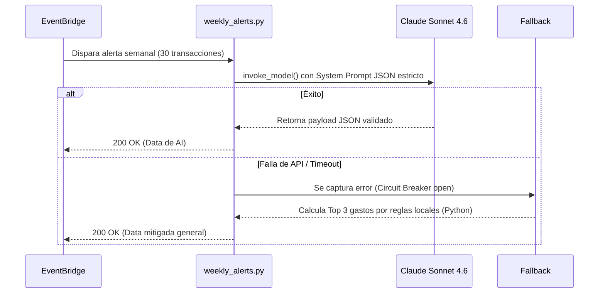
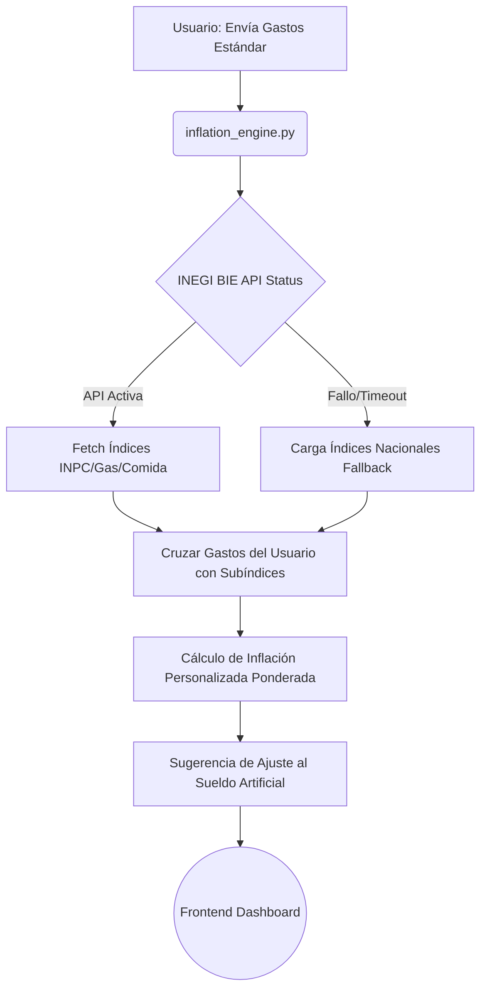

# Arquitectura AI de Incomia

Este directorio aloja la lógica de inteligencia artificial exclusiva del lado del servidor (Microservicios en Python preparados para desplegarse como AWS Lambdas). El propósito principal de estos scripts es analizar flujos financieros, proveer recomendaciones usando Modelos de Lenguaje Granes (LLMs) y calcular un pronóstico del poder adquisitivo para trabajadores de la economía gig (freelancers, repartidores, etc) en México.

## Componentes y Flujo de Datos

### 1. Motor de Alertas Semanales (`weekly_alerts.py`)
El generador de alertas consolidado procesa el historial transaccional del usuario empoderado por IA generativa para dictar estrategias semanales claras y concisas.

- **Flujo de Datos:** 
  1. La Lambda recibe las últimas 30 transacciones del usuario.
  2. Las transacciones se formatean a cadena junto con un `System Prompt` enfocado contextualmente en la economía gig.
  3. Se realiza una solicitud API con el cliente de `boto3` dirigiendo el payload al servicio AWS Bedrock.
- **Integración con Amazon Bedrock:** 
  - Empleamos **Claude Sonnet 4.6** (`anthropic.claude-4-6-sonnet-v1:0`). 
  - La temperatura generativa se configura extremadamente baja (`0.2`). 
  - Se instruye estrictamente devolver *solo un objeto JSON* que contiene:
    1. Un "Top 3" general de los mayores gastos discrecionales categorizados ("entretenimiento", "comida fuera") listando los establecimientos.
    2. Una recomendación amigable, consolidada y en español de México.
    3. Una justificación para hacer ajustes al *Sueldo Artificial* si el superávit/déficit financiero es consistente.
- **Circuit Breaker / Fallback:** En caso de caída de AWS Bedrock (Timeout o Unrecognized Client), el script detona una función con reglas basadas puramente en Python para aproximar un "Top 3" de gastos buscando categorías variables y emitiendo una alerta estándar precargada, asegurando que el frontend no rompa.

### 2. Motor de Inflación Personalizada (`inflation_engine.py`)
Calcula de manera exacta los golpes al poder adquisitivo basados en los propios gastos del usuario en lugar del estándar genérico.
- **Flujo de Datos:**
  1. Emplea la **API del INEGI (BIE - Banco de Información Económica)** para extraer dinámicamente los subíndices inflacionarios actualizados referentes a rubros esenciales como alimentos o gasolina.
  2. Recibe por parámetro un listado de los gastos más frecuentes (`recurring_expenses`).
  3. Pondera matemáticamente el peso de sus gastos en el total y los cruza con la tasa de inflación registrada de subíndice BIE correspondiente, generando una **"Tasa de Inflación Personalizada"**.
  4. La diferencia se computa de inmediato sugiriendo qué tanto debería percibir extra (incremento al "Sueldo Artificial") el usuario para que mantenga el mismo poder de compra que el trimestre anterior.
- **Fallback:** En caso de fallas de fetch de red, aplica una tasa estándar codificada y un cálculo de subíndice suavizado como un parche predictivo en lo que el portal del INEGI redestablece servicio.

### 3. Asesor Financiero Base (`advice_generator.py`)
- Sigue la misma estructura base que `weekly_alerts`, pero llama activamente a predicciones extensas de probabilidad de quiebra (`liquidity_forecast`). 
- Emplea opcionalmente **Claude Sonnet 4.6** para interacciones conversacionales profundas donde evalúa metas de resiliencia completas dentro de un contexto de hasta 14 días.

## Diagramas de Flujo y Casos de Uso

### Motor de Alertas (Bedrock Workflow)

### Motor de Inflación (INEGI Workflow)

---
> **Nota de Seguridad**: Cualquier clave de acceso (como `INEGI_TOKEN` para BIE o credenciales de AWS Boto3) siempre son adquiridas dinámicamente del sistema de variables de entorno y jamás son publicadas en los repositorios de este directorio.
